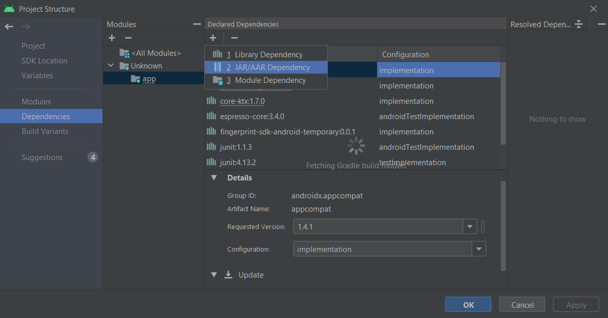
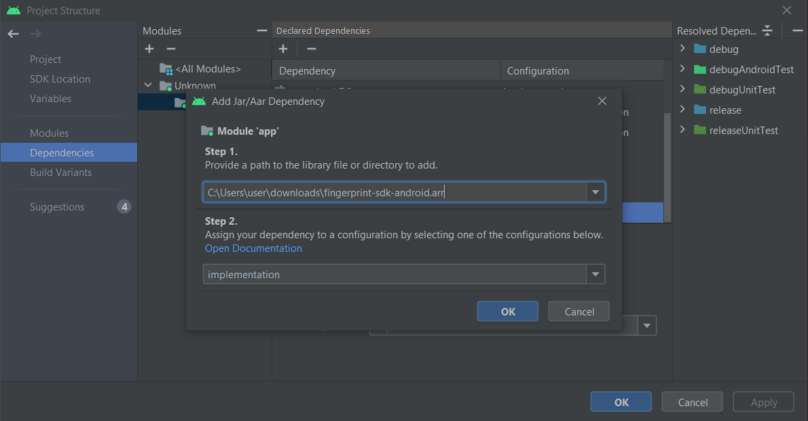

# BioPass ID Fingerprint SDK Demo

# Dependencies

```gradle
dependencies {
    // Fingerprint SDK
    implementation 'com.biopass-id:fingerprint-sdk-android-temporary:0.0.3'
    implementation 'com.google.android.gms:play-services-vision:20.1.3'

    // Retrofit
    implementation 'com.squareup.retrofit2:retrofit:2.5.0'
    implementation 'com.squareup.retrofit2:converter-gson:2.5.0'
}
```

# Prerequisites

```
- Java 8 or higher
- Gradle Version: 5.6.4 or higher
- Android Gradle Plugin Version: 3.5.2 or higher
- A device with a camera
- License key
- Internet connection is required to verify the license
```

Change the minimum Android sdk version to 21 (or higher) in your `app/build.gradle` file.

```gradle
minSdkVersion 21
```

# Installation

## With Gradle

The simplest and easiest way to install the plugin to your project, is to just add the following dependencies to your build.gradle:

```gradle
dependencies {
    implementation "com.biopass-id:fingerprint-sdk-android-temporary:tag"
}
```

Then on your settings.gradle file:

```gradle
repositories {
    // Fingerprint repository on GitHub Packages
    maven {
        url = uri("https://maven.pkg.github.com/biopass-id/fingerprint-sdk-android-temporary")
        /**
         * It is recommended that credentials are stored in environment variables
         * or in local.properties
        */
        credentials {
            username = "your-username"
            password = "your-token"
        }
    }
}
```

Since we are using GitHub Packages as a tool to de publish our packages, it will need an authentication using your github account and a generated token, and store then on a local.properties file.

Here are the steps how to generate a token:

1. log in your github account
2. In the upper-right corner of any page, click your profile photo, then click Settings.
3. In the left sidebar, click Developer settings.
4. In the left sidebar, click Personal access tokens.
5. Click Generate new token.
6. Give your token a descriptive name (can be any name)
7. Click Generate token.

For more information, here you can find the [oficial Github Guide](https://docs.github.com/en/authentication/keeping-your-account-and-data-secure/creating-a-personal-access-token)

## With Local File

Another alternative to use BioPassID Fingerprint SDK plugin is to download and install the AAR file locally. [Here you can find the latest releases](https://github.com/biopass-id/fingerprint-sdk-android-temporary/releases) and after downloading place the .aar file on our project folder (if you prefer you can put whetever you like).

We will use Android Studio for the following steps,

1. First, with your project open, go to **File --> Project Structure --> Dependencies**.
2. Then go to the Dependencies tab, and click on the plus symbol to show the option to add a JAR/AAR dependency.
   
3. On step 1 input the AAR file path, and select the implementation option on step 2.
   
4. Just rebuild your project and should be ready to use.

# Example

## EnrollPersonRequest

```Kotlin
data class EnrollPersonRequest(
    @SerializedName("Person") val person: PersonRequest
)

data class PersonRequest(
    @SerializedName("CustomID") val customID: String,
    @SerializedName("Fingers") val fingers: List<FingerPersonRequest>?
)

data class FingerPersonRequest(
    @SerializedName("Finger-1") val finger1: String,
    @SerializedName("Finger-2") val finger2: String,
    @SerializedName("Finger-3") val finger3: String,
    @SerializedName("Finger-4") val finger4: String,
)
```

## EnrollPersonResponse

```Kotlin
data class EnrollPersonResponse(
    @SerializedName("Person") val person: PersonResponse?,
    @SerializedName("Message") val message: String?
)

data class PersonResponse(
    @SerializedName("ClientID") val clientID: String?,
    @SerializedName("CustomID") val customID: String?,
    @SerializedName("BioPassID") val bioPassID: String?
)
```

## BioPassIDApi

```Kotlin
interface BioPassIDApi {
    @Headers("Content-Type: application/json", "Ocp-Apim-Subscription-Key: your-api-key")
    @POST("multibiometrics/enroll")
    fun enrollPerson(@Body enrollPersonRequest: EnrollPersonRequest) : Call<EnrollPersonResponse>
}
```

## Network

```Kotlin
class Network {
    companion object {

        /** Retorna uma Instância do Client Retrofit para Requisições
         */
        fun getRetrofitInstance() : BioPassIDApi {
            return Retrofit.Builder()
                .baseUrl("https://api.biopassid.com/")
                .addConverterFactory(GsonConverterFactory.create())
                .build()
                .create(BioPassIDApi::class.java)
        }
    }
}
```

## MainActivity XML

```xml
<?xml version="1.0" encoding="utf-8"?>
<androidx.constraintlayout.widget.ConstraintLayout xmlns:android="http://schemas.android.com/apk/res/android"
    xmlns:app="http://schemas.android.com/apk/res-auto"
    xmlns:tools="http://schemas.android.com/tools"
    android:layout_width="match_parent"
    android:layout_height="match_parent"
    tools:context=".MainActivity">

    <Button
        android:id="@+id/btnFingerCapture"
        android:layout_width="wrap_content"
        android:layout_height="wrap_content"
        android:layout_marginBottom="324dp"
        android:text="Finger Capture"
        app:layout_constraintBottom_toBottomOf="parent"
        app:layout_constraintLeft_toLeftOf="parent"
        app:layout_constraintRight_toRightOf="parent" />

</androidx.constraintlayout.widget.ConstraintLayout>
```

## Using Activity

### MainActivity

```Kotlin
class MainActivity : AppCompatActivity() {
    private val TAG = "FingerDemo"
    private lateinit var btnFingerCapture: Button

    override fun onCreate(savedInstanceState: Bundle?) {
        super.onCreate(savedInstanceState)
        setContentView(R.layout.activity_main)

        btnFingerCapture = findViewById(R.id.btnFingerCapture)

        // Instantiate Fingerprint config by passing your license key
        val config = FingerprintConfig()
            .setLicenseKey("your-license-key")

        // Handle Fingerprint callback
        val callback = object : FingerprintCaptureListener {
            override fun onFingerCapture(images: List<Bitmap>) {
                // Encode Bitmap to base64 string
                val finger1 = bitmapToBas64(images[0])
                val finger2 = bitmapToBas64(images[1])
                val finger3 = bitmapToBas64(images[2])
                val finger4 = bitmapToBas64(images[3])

                // Instantiate Enroll request
                val enrollPersonRequest =
                    EnrollPersonRequest(
                        PersonRequest(
                            "your-customID",
                            listOf(FingerPersonRequest(finger1, finger2, finger3, finger4))
                        )
                    )

                // Get retrofit
                val retrofit = Network.getRetrofitInstance()

                // Execute request to the BioPass ID API
                val callback = retrofit.enrollPerson(enrollPersonRequest)

                // Handle API response
                callback.enqueue(object : Callback<EnrollPersonResponse> {
                    override fun onFailure(call: Call<EnrollPersonResponse>, t: Throwable) {
                        Log.e(TAG, "Error trying to call enroll person. ${t.message}")
                    }

                    override fun onResponse(
                        call: Call<EnrollPersonResponse>,
                        response: Response<EnrollPersonResponse>
                    ) {
                        Log.d(TAG, "EnrollPersonResponse: ${response.body()}")
                    }
                })
            }

            override fun onCaptureCanceled() {}
            override fun onStatusChanged(state: FingerprintCaptureState) {}
            override fun onFingerDetected(displayFingerRects: Array<Rect>) {}
            override fun onClassificationChanged(classif: String) {}
        }

        // Build Fingerprint camera view
        btnFingerCapture.setOnClickListener {
            Fingerprint.buildCameraView(this, config, callback)
        }
    }

    private fun bitmapToBas64(bitmap: Bitmap): String {
        val stream = ByteArrayOutputStream()
        bitmap.compress(Bitmap.CompressFormat.PNG, 100, stream)
        val byteArray: ByteArray = stream.toByteArray()
        stream.close()
        return Base64.encodeToString(byteArray, Base64.NO_WRAP)
    }
}
```

## Using Fingerprint View

### MainActivity

```Kotlin
class MainActivity : AppCompatActivity() {
    private val TAG = "FingerDemo"
    private lateinit var btnFingerCapture: Button

    override fun onCreate(savedInstanceState: Bundle?) {
        super.onCreate(savedInstanceState)
        setContentView(R.layout.activity_main)

        btnFingerCapture = findViewById(R.id.btnFingerCapture)

        // Register ActivityForResult
        val resultLauncher = registerForActivityResult(ActivityResultContracts.StartActivityForResult()) { result ->
            if (result.resultCode == Activity.RESULT_OK) {
                if (Person.fingers.isNotEmpty()) {
                    // Encode Bitmap to base64 string
                    val finger1 = bitmapToBas64(Person.fingers[0])
                    val finger2 = bitmapToBas64(Person.fingers[1])
                    val finger3 = bitmapToBas64(Person.fingers[2])
                    val finger4 = bitmapToBas64(Person.fingers[3])

                    // Instantiate Enroll request
                    val enrollPersonRequest =
                        EnrollPersonRequest(
                            PersonRequest(
                                "your-customID",
                                listOf(FingerPersonRequest(finger1, finger2, finger3, finger4))
                            )
                        )

                    // Get retrofit
                    val retrofit = Network.getRetrofitInstance()

                    // Execute request to the BioPass ID API
                    val callback = retrofit.enrollPerson(enrollPersonRequest)

                    // Handle API response
                    callback.enqueue(object : Callback<EnrollPersonResponse> {
                        override fun onFailure(call: Call<EnrollPersonResponse>, t: Throwable) {
                            Log.e(TAG, "Error trying to call enroll person. ${t.message}")
                        }

                        override fun onResponse(
                            call: Call<EnrollPersonResponse>,
                            response: Response<EnrollPersonResponse>
                        ) {
                            Log.d(TAG, "EnrollPersonResponse: ${response.body()}")
                        }
                    })
                }
            }
        }

        // Start CameraActivity
        btnFingerCapture.setOnClickListener {
            val intent = Intent(this, CameraActivity::class.java)
            resultLauncher.launch(intent)
        }
    }

    private fun bitmapToBas64(bitmap: Bitmap): String {
        val stream = ByteArrayOutputStream()
        bitmap.compress(Bitmap.CompressFormat.PNG, 100, stream)
        val byteArray: ByteArray = stream.toByteArray()
        stream.close()
        return Base64.encodeToString(byteArray, Base64.NO_WRAP)
    }
}
```

### CameraActivity XML

```xml
<?xml version="1.0" encoding="utf-8"?>
<androidx.constraintlayout.widget.ConstraintLayout xmlns:android="http://schemas.android.com/apk/res/android"
    xmlns:app="http://schemas.android.com/apk/res-auto"
    xmlns:tools="http://schemas.android.com/tools"
    android:layout_width="match_parent"
    android:layout_height="match_parent"
    tools:context=".CameraActivity">

    <br.com.biopassid.fingerprintsdk.ui.view.FingerprintView
        android:id="@+id/fingerprint"
        android:layout_width="match_parent"
        android:layout_height="match_parent"
        app:captureType="leftHandFingers"
        app:fingersToCapture="4"
        app:licenseKey="your-license-key"
        app:outputType="captureAndSegmentation"
        app:showDistanceIndicatorView="true"
        app:showFingersIndicatorView="true"
        app:showStatusView="true" />

</androidx.constraintlayout.widget.ConstraintLayout>
```

### CameraActivity

```Kotlin
class CameraActivity : AppCompatActivity() {
    private lateinit var fingerprint: FingerprintView

    override fun onCreate(savedInstanceState: Bundle?) {
        super.onCreate(savedInstanceState)
        setContentView(R.layout.activity_camera)

        fingerprint = findViewById(R.id.fingerprint)

        // Handle Fingerprint callback
        fingerprint.setCaptureListener(object : FingerprintCaptureListener {
            override fun onFingerCapture(images: List<Bitmap>) {
                Person.fingers = images
                setResult(RESULT_OK)
                finish()
            }

            override fun onCaptureCanceled() {}
            override fun onStatusChanged(state: FingerprintCaptureState) {}
            override fun onFingerDetected(displayFingerRects: Array<Rect>) {}
            override fun onClassificationChanged(classif: String) {}
        })
    }
}
```

### Person Object

```Kotlin
object Person {
    var fingers: List<Bitmap> = ArrayList()
}
```
